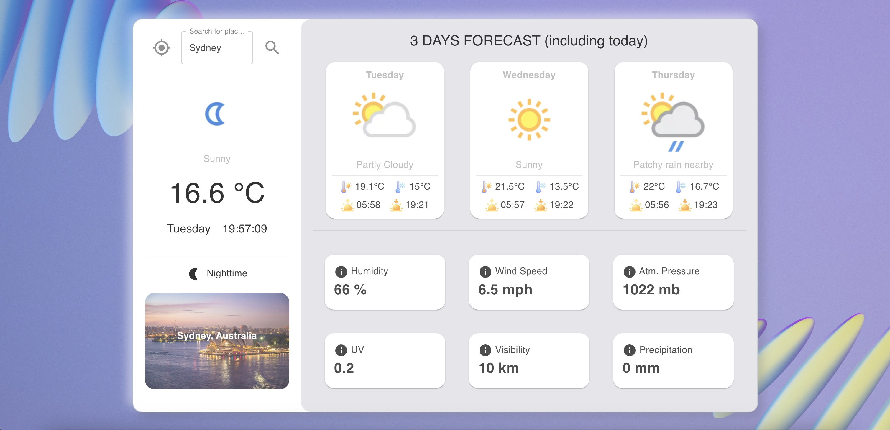

# city-weather-app

## Overview
This is a Weather App that allows users to check current weather conditions and forecasts for different cities.

## Features
- **Current weather information**: Displays the current weather for a specified city.
- **Weather forecasts for the upcoming days**: Provides a forecast for the next 3 days.
- **Image search functionality using Pixabay**: Allows users to search for images related to the city.

## Getting Started
To run this project locally, you need to create a `.env` file in the root directory of the project. This file should contain your API keys for the Weather API and Pixabay. 

- **Weather API**: https://www.weatherapi.com
- **Pixabay:** https://pixabay.com

1. Clone the repository to your local machine:

   ```bash
   git clone git@github.com:Harry-Liu97/city-weather-app.git
   ```
2. Install the dependencies:
   ```bash
   npm install
   ```
1. Create a new .env file:
   ```bash
   touch .env
   ```
2. Update the .env file with your actual API keys, replacing the placeholders. It should look like this:
    ```bash
    REACT_APP_WEATHER_API_KEY=your_actual_weather_api_key
    REACT_APP_PIXABAY_API_KEY=your_actual_pixabay_api_key
   ```
3. After setting up the .env file, you can start the project with:
   ```bash
   npm start
   ```

## Screenshots
Here is a screenshot of the Weather App's main interface:


